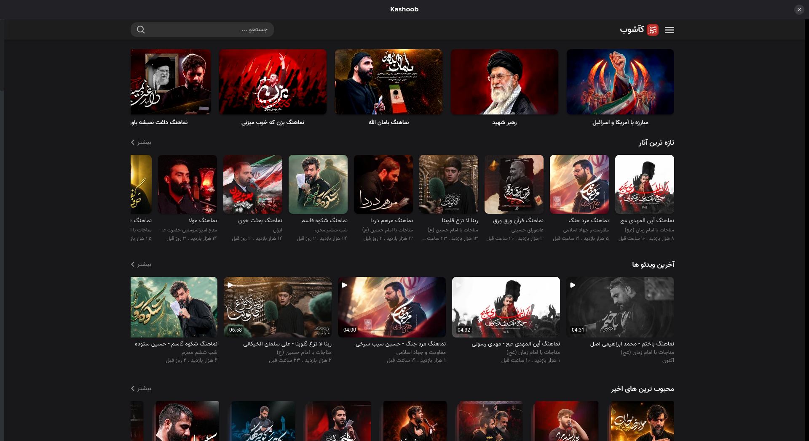

<div align="center">
  
  <h1>Kashoob Desktop (Unofficial)</h1>
  <p><i>A beautiful, native GTK4/Libadwaita Linux desktop client for Kashoob.com</i></p>

  
  
  
</div>

---

<div align="center">
  
</div>

A seamless, native Linux wrapper for [Kashoob.com](https://kashoob.com), bringing the ultimate Persian elegy (Madahi) and religious audio streaming experience directly to your desktop.

## 🚀 Installation

We provide a smart bash installer that will automatically detect your OS, install any missing dependencies, download the app icon, and set up your GNOME desktop shortcut!

1. Clone or download this repository.
2. Open a terminal inside the folder and run:
```bash
chmod +x install.sh
./install.sh
```
3. Open your Linux Application Launcher, search for **Kashoob**, and enjoy!

## 🗑️ Uninstallation

If you ever wish to completely remove the app and its shortcut from your system, simply use the uninstaller flag:
```bash
./install.sh --uninstall
```

---

## 🙏 Special Thanks

A massive thank you to the official **[Kashoob](https://kashoob.com)** team for building such an incredible, rich, and fast platform for religious audio and videos. This desktop application is simply a love letter to their hard work, designed to help Linux users enjoy their beautiful platform natively!

## ⚖️ Disclaimer

**This is an unofficial, community-built, open-source application.** 
All audio, content, the "Kashoob" name, and the Kashoob logo are the intellectual property of the official Kashoob team. This project is not affiliated with, endorsed by, or sponsored by Kashoob.
